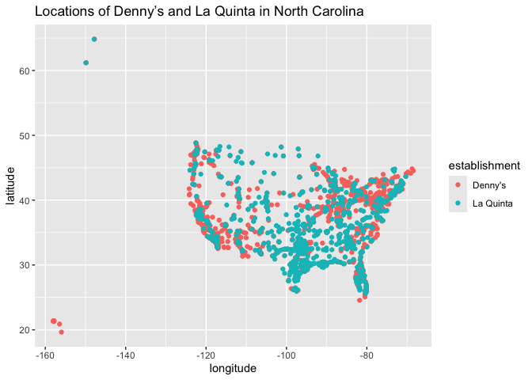
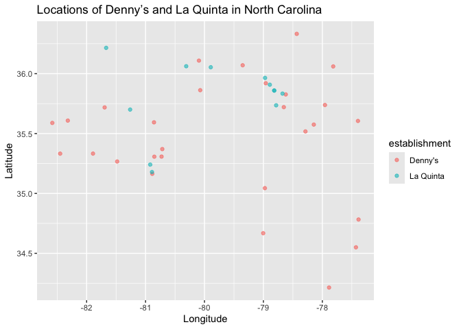

Lab 04 - Visualizing Spatial Data
================
Anahatt Virk
06/26/25

### Load packages and data

``` r
install.packages("devtools", repos = "https://cloud.r-project.org")
```

    ## Installing package into '/Users/anahattvirk/Library/R/x86_64/4.5/library'
    ## (as 'lib' is unspecified)

    ## 
    ## The downloaded binary packages are in
    ##  /var/folders/tb/8n78wkj122z51qjf26rn855h0000gn/T//RtmpgKLzCi/downloaded_packages

``` r
devtools::install_github("tidyverse/dsbox")
```

    ## Using GitHub PAT from the git credential store.

    ## Skipping install of 'dsbox' from a github remote, the SHA1 (244ecdfe) has not changed since last install.
    ##   Use `force = TRUE` to force installation

``` r
library(tidyverse) 
library(dsbox) 
```

``` r
states <- read_csv("data/states.csv")
```

### Exercise 1

The Denny’s dataset has 1643 rows and 6 columns. Each row represents one
Denny’s location and the variables are address, city, state, zipcode,
longitude, and latitude.

### Exercise 2

The La Quinta dataset has 909 rows and 6 columns. Each row represents
one La Quinta location and the variables are address, city, state,
zipcode, longitude, and latitude.

### Exercise 3

From looking at the La Quinta website, there are La Quinta hotels
outside of the U.S. These countries include Canada, Mexico, China, New
Zealand, Georgia, Turkey, UAE, Chile, Colombia, and Ecuador. On the
other hand, from looking at the Denny’s website it seems that they only
have locations in the U.S.

### Exercise 4

One way to determine whether either establishment has locations outside
of the U.S. by looking at the data is to filter by state by using code.
This way, you are able to pull out all international locations. You
could also do so by filtering by city.

### Exercise 5

``` r
dn <- dennys %>%
  filter(!(state %in% states$abbreviation))
```

There are 0 Denny’s locations outside the US.

### Exercise 6

``` r
dn %>%
  mutate(country = "United States")
```

    ## # A tibble: 0 × 7
    ## # ℹ 7 variables: address <chr>, city <chr>, state <chr>, zip <chr>,
    ## #   longitude <dbl>, latitude <dbl>, country <chr>

There are 0 Denny’s locations outside the US.

### Exercise 7

Outside of the U.S., there are La Quinta hotels in Canada, Mexico,
China, New Zealand, Georgia, Turkey, UAE, Chile, Colombia, and Ecuador.

### Exercise 8

``` r
lq <- laquinta %>% 
  mutate(country = case_when(
    state %in% state.abb ~ "United States",
    state %in% c("ON", "BC") ~ "Canada",
    state == "ANT" ~ "Colombia",
    state == "MX" ~ "Mexico", 
    state == "CH" ~ "China",
    state == "NZ" ~ "New Zealand",
    state == "GE" ~ "Georgia",
    state == "TR" ~ "Turkey",
    state %in% c("AE", "UAE") ~ "UAE",
    state == "CL" ~ "Chile",
    state == "EC" ~ "Ecuador"
  ))
```

### Exercise 9

``` r
dn <- dennys %>%
  filter(state %in% states$abbreviation)
  table(dn$state)
```

    ## 
    ##  AK  AL  AR  AZ  CA  CO  CT  DC  DE  FL  GA  HI  IA  ID  IL  IN  KS  KY  LA  MA 
    ##   3   7   9  83 403  29  12   2   1 140  22   6   3  11  56  37   8  16   4   8 
    ##  MD  ME  MI  MN  MO  MS  MT  NC  ND  NE  NH  NJ  NM  NV  NY  OH  OK  OR  PA  RI 
    ##  26   7  22  15  42   5   4  28   4   5   3  10  28  35  56  44  15  24  40   5 
    ##  SC  SD  TN  TX  UT  VA  VT  WA  WI  WV  WY 
    ##  17   3   7 200  27  28   2  49  25   3   4

``` r
dn_counts <- dn %>%
  count(state, sort = TRUE)
  top_5_dennys <- dn_counts %>% slice(1:5)
  bottom_5_dennys <- dn_counts %>% slice_tail(n = 5)
  
top_5_dennys
```

    ## # A tibble: 5 × 2
    ##   state     n
    ##   <chr> <int>
    ## 1 CA      403
    ## 2 TX      200
    ## 3 FL      140
    ## 4 AZ       83
    ## 5 IL       56

``` r
bottom_5_dennys
```

    ## # A tibble: 5 × 2
    ##   state     n
    ##   <chr> <int>
    ## 1 SD        3
    ## 2 WV        3
    ## 3 DC        2
    ## 4 VT        2
    ## 5 DE        1

California has the most Denny’s locations and Delaware has the least.
This is not surprising due to the sizes and populations of the two
states.

``` r
lq <- lq %>%
  filter(country == "United States")

lq_counts <- lq %>%
  count(state, sort = TRUE)
  top_5_lq <- lq_counts %>% slice(1:5)
  bottom_5_lq <- lq_counts %>% slice_tail(n = 5)
  
top_5_lq
```

    ## # A tibble: 5 × 2
    ##   state     n
    ##   <chr> <int>
    ## 1 TX      237
    ## 2 FL       74
    ## 3 CA       56
    ## 4 GA       41
    ## 5 TN       30

``` r
bottom_5_lq
```

    ## # A tibble: 5 × 2
    ##   state     n
    ##   <chr> <int>
    ## 1 NH        2
    ## 2 RI        2
    ## 3 SD        2
    ## 4 VT        2
    ## 5 ME        1

Texas has the most La Quinta hotels and Maine has the least. Once again,
due to the sizes, populations, and tourist attractions of the two
states, this is not a surprising result.

### Exercise 10

``` r
dn %>%
  count(state) %>%
  inner_join(states, by = c("state" = "abbreviation")) %>%
  mutate(locations_per_1000_sq_miles = n / (area / 1000)) %>%
  arrange(desc(locations_per_1000_sq_miles))
```

    ## # A tibble: 51 × 5
    ##    state     n name                     area locations_per_1000_sq_miles
    ##    <chr> <int> <chr>                   <dbl>                       <dbl>
    ##  1 DC        2 District of Columbia     68.3                      29.3  
    ##  2 RI        5 Rhode Island           1545.                        3.24 
    ##  3 CA      403 California           163695.                        2.46 
    ##  4 CT       12 Connecticut            5543.                        2.16 
    ##  5 FL      140 Florida               65758.                        2.13 
    ##  6 MD       26 Maryland              12406.                        2.10 
    ##  7 NJ       10 New Jersey             8723.                        1.15 
    ##  8 NY       56 New York              54555.                        1.03 
    ##  9 IN       37 Indiana               36420.                        1.02 
    ## 10 OH       44 Ohio                  44826.                        0.982
    ## # ℹ 41 more rows

DC, Rhode Island, and California have the most Denny’s locations per
thousand square miles.

``` r
lq %>%
  count(state) %>%
  inner_join(states, by = c("state" = "abbreviation")) %>%
  mutate(locations_per_1000_sq_miles = n / (area / 1000)) %>%
  arrange(desc(locations_per_1000_sq_miles))
```

    ## # A tibble: 48 × 5
    ##    state     n name             area locations_per_1000_sq_miles
    ##    <chr> <int> <chr>           <dbl>                       <dbl>
    ##  1 RI        2 Rhode Island    1545.                       1.29 
    ##  2 FL       74 Florida        65758.                       1.13 
    ##  3 CT        6 Connecticut     5543.                       1.08 
    ##  4 MD       13 Maryland       12406.                       1.05 
    ##  5 TX      237 Texas         268596.                       0.882
    ##  6 TN       30 Tennessee      42144.                       0.712
    ##  7 GA       41 Georgia        59425.                       0.690
    ##  8 NJ        5 New Jersey      8723.                       0.573
    ##  9 MA        6 Massachusetts  10554.                       0.568
    ## 10 LA       28 Louisiana      52378.                       0.535
    ## # ℹ 38 more rows

Rhode Island, Florida, and Connecticut have the most La Quinta hotels
per thousand square miles.

### Exercise 11

``` r
dn <- dn %>%
  mutate(establishment = "Denny's")

lq <- lq %>%
  mutate(establishment = "La Quinta")

dn_lq <- bind_rows(dn, lq)

ggplot(dn_lq, mapping = aes(x = longitude, y = latitude, color = establishment)) +
  geom_point() + 
  labs(title = "Locations of Denny’s and La Quinta in North Carolina")
```

<!-- -->

``` r
dn_lq_nc <- dn_lq %>%
  filter(state == "NC")
```

``` r
ggplot(dn_lq_nc, mapping = aes(x = longitude, y = latitude, color = establishment)) +
  geom_point(alpha = 0.6) +
  labs(title = "Locations of Denny’s and La Quinta in North Carolina",
    x = "Longitude",
    y = "Latitude")
```

<!-- -->

Visually, it does not seem like Mitch Hedberg’s joke holds up as well
here as many Denny’s locations in North Carolina are not next to La
Quinta hotels.

### Exercise 12
